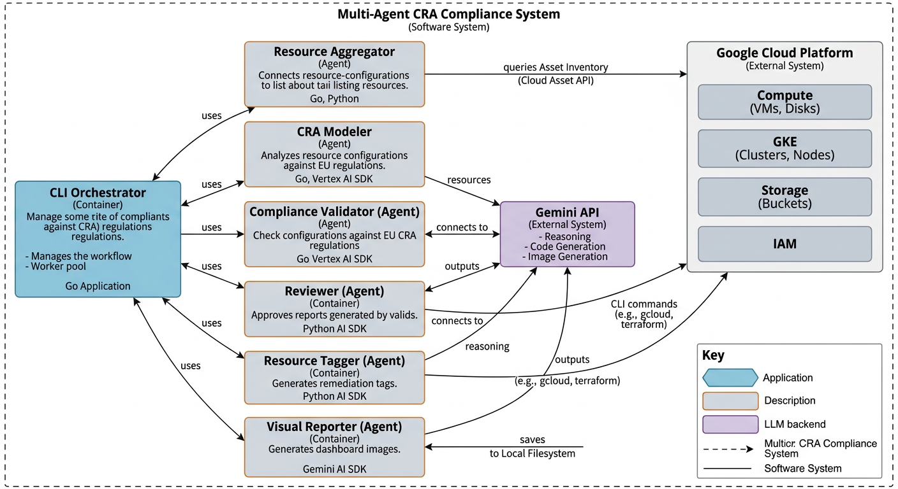

# Multi-Agent CRA Security Platform

[](https://opensource.org/licenses/MIT)

<<<<<<< HEAD
A scalable, event-driven multi-agent system designed to assess Google Cloud infrastructure against the **Cyber Resilience Act (CRA)**.
=======
A scalable, event-driven multi-agent system designed to assess Google Cloud infrastructure against the EU Cyber Resilience Act (CRA). The goal is to provide Security Engineers with a real-time, dashboard-driven tool to monitor, audit, and enforce CRA compliance across their GCP estate.
>>>>>>> 20f1edba4dc31822304405aa47e4519927639d0a

## 🚀 Features

*   **Autonomous Agents:** Specialized AI agents for Discovery, Modeling, Validation, and Reporting.
*   **Event-Driven:** Decoupled architecture using Google Cloud Pub/Sub.
*   **Unified Deployment:** Backend API and Frontend Dashboard served from a single, scalable Cloud Run service.
*   **AI-Powered:** Leverages Gemini 1.5 Pro for deep reasoning and compliance mapping.
*   **Infrastructure as Code:** Full Terraform setup included.
*   **Security:** Google Cloud Armor ready (Model Armor for AI protection).

## 🏗️ System Architecture



The system is composed of the following key components:

1.  **Unified Server (Go):** 
    *   Hosts the **REST API** for triggering scans.
    *   Serves the **React/Next.js Dashboard** (static export) directly.
    *   Handles authentication and audit logging.
2.  **Worker (Go):** An autonomous worker service that consumes scan requests from Pub/Sub, orchestrates the AI agents, and performs the actual compliance assessments.
3.  **Pub/Sub:** Acts as the asynchronous message bus, decoupling the API server from the heavy processing in the workers.
4.  **Firestore:** Stores scan results, compliance reports, and audit logs.
5.  **Gemini AI:** The reasoning engine used by the agents to analyze infrastructure and determine compliance.

### Agent Workflow


The compliance process is driven by a chain of specialized agents:

*   **Resource Aggregator:** Discovers and ingests GCP assets.
*   **CRA Modeler:** Applies the CRA compliance framework to the data.
*   **Compliance Validator:** Validates the model against regulatory rules.
*   **Reviewer:** Provides final approval and summary of the report.
*   **Resource Tagger:** Tags resources with compliance status and remediation steps.

## 📂 Project Structure

```
├── cmd/
│   ├── server/      # API Server + Static File Server
│   └── worker/      # Agent Orchestration Worker
├── pkg/             # Shared libraries (Agents, Core, Config)
├── web/             # Next.js Frontend Dashboard
├── terraform/       # IaC definitions
└── cloudbuild.yaml  # CI/CD Pipeline
```

## 🛠️ Prerequisites

*   Go 1.25+
*   Node.js 20+ (for frontend build)
*   Google Cloud Project with Billing enabled
*   `gcloud` CLI installed and authenticated
*   `terraform` installed
*   Gemini API Key
*   Docker & Docker Compose

# Deployment Instructions

<<<<<<< HEAD
We provide a `Makefile` and `docker-compose` setup for easy local development.
=======
This document provides detailed instructions for deploying the Multi-Agent CRA System locally, to Google Kubernetes Engine (GKE) using Terraform, and to Cloud Run using the provided shell script.
>>>>>>> 20f1edba4dc31822304405aa47e4519927639d0a

## 1. Local Deployment

Run the application locally for development and testing.

### Prerequisites
*   **Go**: Version 1.25 or higher ([Download](https://go.dev/dl/))
*   **Google Cloud Project with Billing enabled**
*   **`gcloud` CLI installed and authenticated**
*   **`terraform` installed**
*   **Gemini API Key**

### Steps
1.  **Clone the repository** (if not already done):
    ```bash
    git clone <repository-url>
    cd multi-agent-cra
    ```

2.  **Set Environment Variables**:
    ```bash
    # Linux/macOS
    export GEMINI_API_KEY="your_actual_api_key_here"

    # Windows (PowerShell)
    $env:GEMINI_API_KEY="your_actual_api_key_here"
    ```
<<<<<<< HEAD
    This will spin up:
    *   **Dashboard & API:** http://localhost:8080
    *   **Pub/Sub Emulator:** http://localhost:8085
    *   **Firestore Emulator:** http://localhost:8081

3.  **Trigger a Scan:**
    Go to the dashboard or use cURL:
    ```bash
    curl -X POST http://localhost:8080/api/scan -d '{"scope": "projects/my-project"}'
    ```

### Production Deployment (Cloud Run)

Use the provided build script to deploy the entire stack to Google Cloud Run. This handles the multi-stage build (Frontend -> Embedded -> Server Container) automatically.

```bash
./build.sh
```

**What happens:**
1.  Frontend is built (`npm run build`).
2.  Go Server is built with embedded frontend assets.
3.  Worker image is built.
4.  Both services (`cra-server`, `cra-worker`) are deployed to Cloud Run.

### Post-Deployment: Security Configuration

The system uses **Google Cloud Armor** with **Model Armor** to protect the AI agents. This must be configured manually in the Google Cloud Console to allow for fine-tuning.

1.  Navigate to **Network Security** > **Cloud Armor**.
2.  Create a new policy named `agent-armor-policy`.
3.  Enable **Model Armor** (AI/LLM Protection) rules to block prompt injection and other attacks.
4.  Attach this policy to the `cra-server` service.

See [SECURITY.md](SECURITY.md) for detailed instructions.
=======

3.  **Run the Application**:
    ```bash
    go run cmd/main.go
    ```
    *Note: The current local execution runs all agents within a single process via the coordinator.*

---

## 2. Google Kubernetes Engine (GKE) Deployment

This method uses **Terraform** to provision a GKE Autopilot cluster, secure secrets, and deploy the agents as separate Kubernetes workloads.

### Prerequisites
*   **Google Cloud Project**: With billing enabled.
*   **Terraform**: Installed.
*   **gcloud CLI**: Installed and authenticated (`gcloud auth login`, `gcloud auth application-default login`).
*   **Docker**: For building the image.

### Step 1: Build and Push Docker Image
Before running Terraform, the container image must exist in a registry (e.g., Google Artifact Registry or Container Registry).

1.  **Set Variables**:
    ```bash
    export PROJECT_ID="your-project-id"
    export IMAGE_NAME="gcr.io/${PROJECT_ID}/agent-cra:latest"
    ```

2.  **Build and Push**:
    ```bash
    # Enable Container Registry API if needed, or use Artifact Registry
    gcloud services enable containerregistry.googleapis.com

    # Build
    docker build -t $IMAGE_NAME .

    # Configure Docker to push to GCR
    gcloud auth configure-docker

    # Push
    docker push $IMAGE_NAME
    ```

### Step 2: Deploy Infrastructure with Terraform
1.  **Navigate to the Terraform directory**:
    ```bash
    cd terraform
    ```

2.  **Create a `terraform.tfvars` file**:
    Create a file named `terraform.tfvars` with your specific configuration. **Do not commit this file.**
    ```hcl
    project_id       = "your-project-id"
    region           = "us-central1"
    cluster_name     = "agent-engine-cluster"
    image_repository = "gcr.io/your-project-id/agent-cra:latest" # Must match the image pushed in Step 1
    gemini_api_key   = "your-actual-gemini-api-key"
    ```

3.  **Initialize and Apply**:
    ```bash
    terraform init
    terraform apply
    ```
    *Confirm the action by typing `yes` when prompted.*

    **What this does:**
    *   Creates a VPC Network and Subnet.
    *   Provisions a GKE Autopilot Cluster.
    *   Creates a Secret in Google Secret Manager for the API Key.
    *   Sets up Workload Identity (IAM binding between K8s Service Accounts and Google Service Accounts).
    *   Deploys 4 microservices (`agent-classifier`, `agent-auditor`, `agent-vuln`, `agent-reporter`).

### Step 3: Verify Deployment
1.  **Get Cluster Credentials**:
    ```bash
    gcloud container clusters get-credentials agent-engine-cluster --region us-central1
    ```

2.  **Check Pods**:
    ```bash
    kubectl get pods
    ```
    You should see pods for each agent (classifier, auditor, vuln, reporter) running.

---

## 3. Cloud Run Deployment

This method uses the `deploy.sh` script to deploy the agents as serverless Cloud Run services.

### Prerequisites
*   **Google Cloud SDK**: `gcloud` installed and authenticated.
*   **Project ID**: Set your active project (`gcloud config set project YOUR_PROJECT_ID`).

### Step 1: Create the API Key Secret
The deployment script expects a secret named `gemini-api-key` to exist in Secret Manager.

```bash
# Replace YOUR_API_KEY with your actual key
echo -n "YOUR_API_KEY" | gcloud secrets create gemini-api-key --data-file=-
```

### Step 2: Run the Deployment Script
1.  **Make the script executable**:
    ```bash
    chmod +x deploy.sh
    ```
>>>>>>> 20f1edba4dc31822304405aa47e4519927639d0a

2.  **Run the script**:
    ```bash
    ./deploy.sh
    ```

<<<<<<< HEAD
```bash
make test
```
=======
    **What this script does:**
    *   Enables necessary Google Cloud APIs.
    *   Creates a dedicated Service Account.
    *   Creates an Artifact Registry repository.
    *   Builds the Docker image using Cloud Build (no local Docker required).
    *   Deploys 4 Cloud Run services, injecting the API Key secret and setting the `AGENT_ROLE` environment variable.

### Step 3: Verify
The script will output the URLs of the deployed services. You can also list them:
```bash
gcloud run services list
```
>>>>>>> 20f1edba4dc31822304405aa47e4519927639d0a
